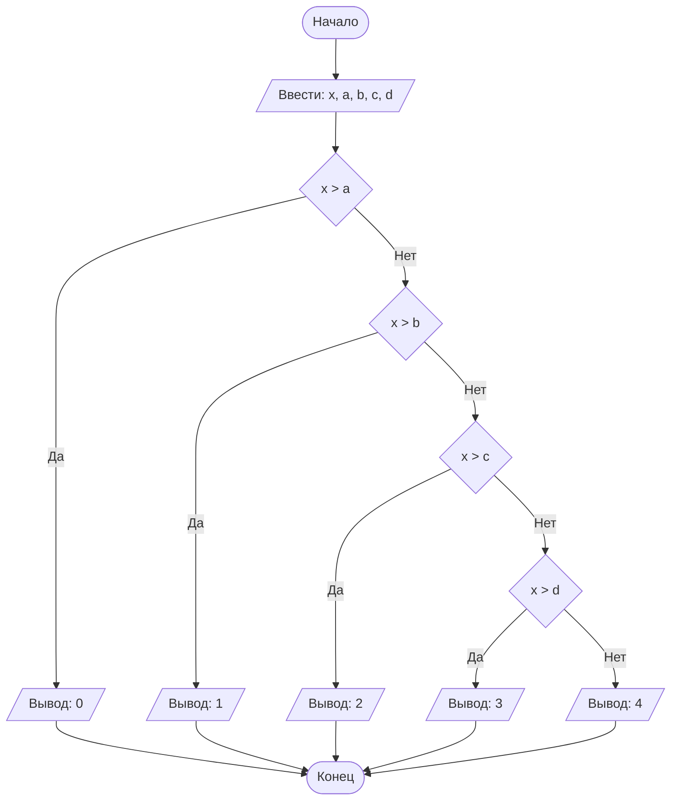

## Отчет по лабораторной работе № 1

#### № группы: `ПМ-2601`

#### Выполнил: `Гаврилов Артём Евгеньевич`

#### Вариант: `3`

### Cодержание:

- [Постановка задачи](#1-постановка-задачи)
- [Входные и выходные данные](#2-входные-и-выходные-данные)
- [Выбор структуры данных](#3-выбор-структуры-данных)
- [Алгоритм](#4-алгоритм)
- [Программа](#5-программа)
- [Анализ правильности решения](#6-анализ-правильности-решения)

### 1. Постановка задачи
> Шарик диаметром X пытаются протащить через последовательность отверстий
> диаметрами A, B, C, D. Через какое количество отверстий удастся 
> протащить шарик? На вход программы подаются натуральные числа X, A, B, C, D

Данная задача завязана на проверке прохождения шарика через отверстия. Если шарик не проходит через отверстие, то следующее отверстие мы не будем рассматривать, так как шарик застрял. Существует 4 проверки на прохождение. Аналогично, если шарик не проходит через условие, то остальные условия не рассматриваются.


### 2. Входные и выходные данные

#### Данные на вход

На вход программа должна получать 5 чисел, которые обозначают диаметр шара X и диаметры отверстий A, B, C, D.
В условии сказано к какому множеству чисел относятся диаметры X, A, B, C, D $\in \mathbb{N}$

|             | Тип                | min значение    | max значение       |
|-------------|--------------------|-----------------|--------------------|
| X (Число 1) | Натуральное число | 1                |  2<sup>31</sup>-1  |
| A (Число 2) | Натуральное число | 1                |  2<sup>31</sup>-1  |
| B (Число 3) | Натуральное число | 1                |  2<sup>31</sup>-1  |
| C (Число 4) | Натуральное число | 1                |  2<sup>31</sup>-1  |
| D (Число 5) | Натуральное число | 1                |  2<sup>31</sup>-1  |


#### Данные на выход

На выходе программа выводит число, обозначающее количество пройденных отверстий шариком.
Количество - целое неотрицательное число

|         | Тип                                | min значение  | max значение    |
|---------|------------------------------------|---------------|-----------------|
| Число 1 | Целое число                        |0              |4                |


### 3. Выбор структуры данных

Программа получает 5 натуральных чисел, не превышающих 2<sup>31</sup>-1. Поэтому для их хранения
можно выделить 5 переменных (`x`, `a`, `b`, `c`, `d`) типа `int`.

|             | название переменной | Тип (в Java) | 
|-------------|---------------------|--------------|
| X (Число 1) | `x`                 | `int`        |
| A (Число 2) | `a`                 | `int`        | 
| B (Число 3) | `b`                 | `int`        | 
| C (Число 4) | `c`                 | `int`        | 
| D (Число 5) | `d`                 | `int`        | 

Для вывода результата необязательно его хранить в отдельной переменной.

### 4. Алгоритм

#### Алгоритм выполнения программы:

1. **Ввод данных:**  
   Программа считывает пять натуральных чисел, обозначенные как `x`, `a`, `b`, `c`, `d`

2. **Сравнение чисел:**  
   - Первое сравнение (`x` и `a`), если x > a, то вывод результата будет число 0 и сравнение завершается. Иначе программа переходит ко второму сравнению
   - Второе сравнение (`x` и `b`), если x > b, то вывод результата будет число 1 и сравнение завершается. Иначе программа переходит ко третьему сравнению
   - Третье сравнение (`x` и `c`), если x > c, то вывод результата будет число 2 и сравнение завершается. Иначе программа переходит ко четвёртому сравнению
   - Четвёртое сравнение (`x` и `d`), если x > d, то вывод результата будет число 3 и сравнение завершается. Иначе программа выводит число 4

   

3. **Вывод результата:**  
   На экран выводится число от 0 до 4, обозначающие количество отверстий, через которые удалось протащить шарик.

#### Блок-схема



### 5. Программа

```java
import java.io.PrintStream;
import java.util.Scanner;

public class Main {

   // Объявляем объект класса Scanner для ввода данных
   public static Scanner in = new Scanner(System.in);

   // Объявляем объект класса PrintStream для вывода данных
   public static PrintStream out = System.out;

   public static void main(String[] args) {
      // считываем числа от пользователя
      int x = in.nextInt();
      int a = in.nextInt();
      int b = in.nextInt();
      int c = in.nextInt();
      int d = in.nextInt();

      // проверяем через какое количество отверстий можно протащить шар
      if (x > a)
         //если диаметр первого отверстия меньше диаметра шара
         out.print(0);
      else if (x > b)
         //если диаметр второго отверстия меньше диаметра шара
         out.print(1);
      else if (x > c)
         //если диаметр третьего отверстия меньше диаметра шара
         out.print(2);
      else if (x > d)
         //если диаметр четвёртого отверстия меньше диаметра шара
         out.print(3);
      else
         // шар прошёл через все отверстия
         out.print(4);
   }
}
```
### 6. Анализ правильности решения
Программа работает корректно на всем множестве решений.

1. Тест на `a < x`:

    - **Input**:
        ```
        10 5 15 15 15
        ```

    - **Output**:
        ```
        0
        ```

2. Тест на `b < x` и `x < a `:

    - **Input**:
        ```
        5 10 3 10 10
        ```

    - **Output**:
        ```
        1
        ```

3. Тест на `c < x` и `x < a & x < b `:

    - **Input**:
        ```
        5 10 8 4 10
        ```

    - **Output**:
        ```
        2
        ```

4. Тест на `d < x` и `x < a & x < b & x < c`:

    - **Input**:
        ```
        5 10 8 7 3
        ```

    - **Output**:
        ```
        3
        ```

5. Тест на `x < a & x < b & x < c & x < d`:

    - **Input**:
        ```
        5 10 8 7 6 
        ```

    - **Output**:
        ```
        4
        ```

